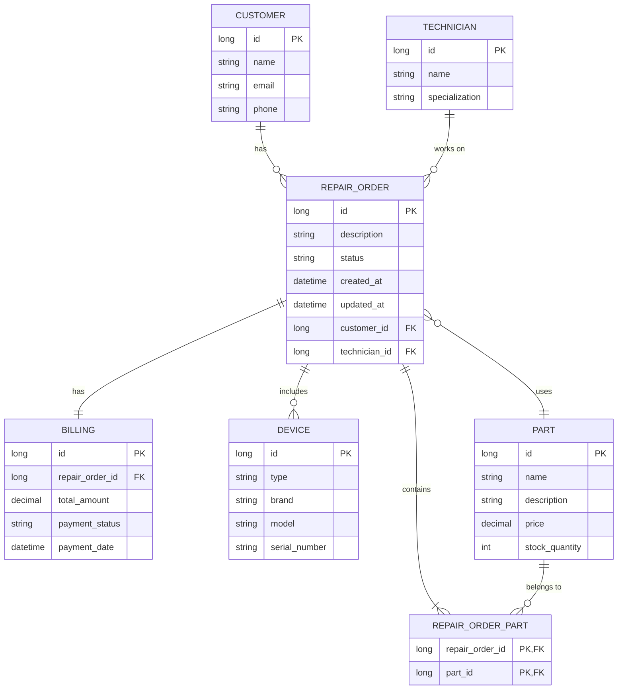

```mermaid
erDiagram
    CUSTOMER ||--o{ REPAIR_ORDER : has
    TECHNICIAN ||--o{ REPAIR_ORDER : "works on"
    REPAIR_ORDER ||--|{ REPAIR_ORDER_PART : contains
    REPAIR_ORDER ||--|| BILLING : "has"
    REPAIR_ORDER ||--o{ DEVICE : includes
    REPAIR_ORDER }o--|| PART : uses
    PART ||--o{ REPAIR_ORDER_PART : "belongs to"

    CUSTOMER {
        long id PK
        string name
        string email
        string phone
    }

    TECHNICIAN {
        long id PK
        string name
        string specialization
    }

    REPAIR_ORDER {
        long id PK
        string description
        string status
        datetime created_at
        datetime updated_at
        long customer_id FK
        long technician_id FK
    }

    DEVICE {
        long id PK
        string type
        string brand
        string model
        string serial_number
    }

    PART {
        long id PK
        string name
        string description
        decimal price
        int stock_quantity
    }

    REPAIR_ORDER_PART {
        long repair_order_id PK,FK
        long part_id PK,FK
    }

    BILLING {
        long id PK
        long repair_order_id FK
        decimal total_amount
        string payment_status
        datetime payment_date
    }
    
```